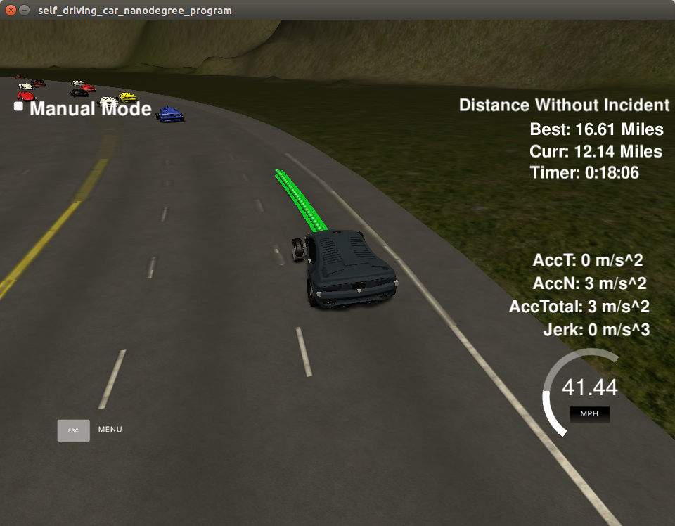

## Introduction
The goal of this project was to create the path planning module of a self-driving car. The environment is a highway-like circular road of length ~4 miles, with 3 lanes and various cars driving on it. The other cars can change speed, but do not change lanes. We receive complete and noise-free information about our surroundings from the simulator. This includes localization and ego velocity including lane center points on the map, and positions and velocities of all other cars on the track. Also included are the previous points of the trajectories passed to the simulator, which can be used to create smooth and consistent trajectories. Perfect control is assumed, in the sense that trajectories are followed exactly by the ego vehicle.

## The implementation
### Constructing the state
In order to create the state of the agent, we read the data from the simulator and refine it into a few high-level features:
1. Ego's current lane.
2. Current lane status (clear, safe speed).
3. Status of lanes to the right and left of current lane, if available (clear, safe speed).

### High-level decision making
These simple features are the basis for our decision making. In essence, we want to move to the clear lane which has the safest speed. Computing the status of our lanes is done with tuneable parameters such as the distance forward and backward in which no car can be present in order for a lane to be considered clear. Safe speed for a lane is the minimal speed of a vehicle in that lane, which is close to the ego vehicle. Note that safety is enforced only during behavioral planning, allowing the trajectory planner to ignore safety concerns, therefore greatly simplifying its trajectory evaluation.

Once the desired lane is identified, we set the desired speed as the safe speed for that lane. The lane along with the desired speed, are the output of the behavioral planner.

### Trajectory planner
Given the desired lane and speed, the trajectory is copmuted using the spline.h library, where we first used the leftover points from the previousely computed trajectory, and then add to them several points on the desired lane, spaced out according to the desired speed (points will be followed in constant time (0.02 seconds each).

## Conclusion
This very simple approach proved to be quite effective, allowing the controlled car to drive more than 4 times around the track without incident. The only incidents noticed were exceeding jerk limits when the bahvioral plan changed "mid-lane". This problem was not solved in this version, but can be addressed by keeping a memory of the current plan, and penalizing consequest plans which do not "agree" with it. This would require some parameter tuning.

